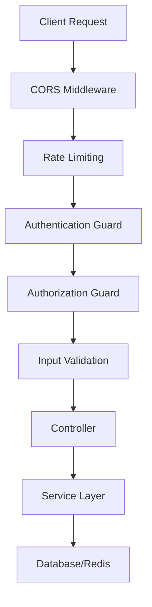

# 🔐 NestJS Authentication System (nest-authx)

A comprehensive, production-ready authentication and authorization system built with NestJS, featuring multiple authentication strategies, security best practices, and enterprise-grade features.

<div align="center">


[](https://github.com/code-breakers/nest-authx/actions)
[](https://codecov.io/gh/code-breakers/nest-authx)
[](https://opensource.org/licenses/MIT)

</div>

---

## 🚀 Features

### 🔑 Authentication Strategies
- **JWT Authentication** with access and refresh tokens
- **Two-Factor Authentication (2FA)** with TOTP support
- **API Key Authentication** for service-to-service communication
- **Google OAuth Integration** for social login
- **Session-based Authentication** with Passport.js

### 🛡️ Authorization & Access Control
- **Role-Based Access Control (RBAC)** with hierarchical permissions
- **Claims-Based Authorization** for fine-grained access control
- **Custom Guards & Decorators** for flexible security
- **Resource-based Authorization** with ownership validation

### 🔒 Security Features
- **Refresh Token Rotation** with automatic invalidation
- **Password Hashing** using bcrypt with configurable salt rounds
- **Rate Limiting** to prevent brute force attacks
- **Security Headers** with Helmet integration
- **CORS Configuration** with environment-based origins
- **Input Validation & Sanitization** with class-validator

### 🏗️ Architecture & Development
- **Modular Architecture** with clear separation of concerns
- **TypeScript** with strict type checking
- **Comprehensive Testing** with Jest (unit & e2e)
- **Docker Support** with multi-stage builds
- **Database Migrations** with TypeORM
- **Redis Integration** for session storage and caching

---

## 📋 Table of Contents

- [Quick Start](#-quick-start)
- [Authentication Branches](#-authentication-branches)
- [Installation](#-installation)
- [Configuration](#-configuration)
- [API Documentation](#-api-documentation)
- [Architecture](#-architecture)
- [Security](#-security)
- [Testing](#-testing)
- [Deployment](#-deployment)
- [Contributing](#-contributing)

---

## 🏃‍♂️ Quick Start

### Prerequisites
- **Node.js** >= 18.x
- **Docker & Docker Compose**
- **PostgreSQL** 13+ (or use Docker)
- **Redis** 6+ (or use Docker)

### 🐳 Using Docker (Recommended)

```bash
# Clone the repository
git clone https://github.com/code-breakers/nest-authx.git
cd nest-authx

# Set up environment variables
cp .env.example .env
# Edit .env with your configuration

# Start all services
docker-compose up -d

# Access the application
# API: http://localhost:3000
# Health Check: http://localhost:3000/health
```

---

## 🌿 Authentication Branches

This project showcases different authentication strategies implemented in separate branches. Each branch focuses on a specific authentication method:

<table>
<thead>
<tr>
<th>Branch</th>
<th>Authentication Strategy</th>
<th>Key Features</th>
<th>Use Case</th>
</tr>
</thead>
<tbody>
<tr>
<td><code>master</code></td>
<td>JWT Authentication</td>
<td>Access/Refresh tokens, Token rotation</td>
<td>Modern web applications, SPAs</td>
</tr>
<tr>
<td><code>2fa</code></td>
<td>Two-Factor Authentication</td>
<td>TOTP, QR codes, Backup recovery codes</td>
<td>High-security applications</td>
</tr>
<tr>
<td><code>api-keys</code></td>
<td>API Key Authentication</td>
<td>Key generation, Scoped permissions</td>
<td>Service-to-service communication</td>
</tr>
<tr>
<td><code>google-auth</code></td>
<td>Google OAuth 2.0</td>
<td>Social login, Profile integration</td>
<td>Consumer applications</td>
</tr>
<tr>
<td><code>role-based-access-control</code></td>
<td>RBAC System</td>
<td>Hierarchical roles, Permission matrix</td>
<td>Enterprise applications</td>
</tr>
<tr>
<td><code>claims-based-access-control</code></td>
<td>Claims-Based Auth</td>
<td>Fine-grained permissions, Custom claims</td>
<td>Complex authorization scenarios</td>
</tr>
<tr>
<td><code>sessions-with-passport</code></td>
<td>Session Authentication</td>
<td>Passport.js integration, Session store</td>
<td>Traditional web applications</td>
</tr>
</tbody>
</table>

### 🔄 Switching Between Strategies

```bash
# List all available branches
git branch -a

# Switch to a specific authentication strategy
git checkout 2fa
npm install
npm run start:dev

# Compare different strategies
git log --oneline --graph --all

# Merge features from different branches (advanced)
git checkout master
git merge --no-ff role-based-access-control
```

---

## 📦 Installation

### Local Development Setup

1. **Clone and install dependencies**
   ```bash
   git clone https://github.com/code-breakers/nest-authx.git
   cd nest-authx
   npm install
   ```

2. **Set up environment variables**
   ```bash
   cp .env.example .env
   # Configure your database and Redis connections
   ```

3. **Start database services**
   ```bash
   # Option 1: Using Docker Compose
   docker-compose up postgres redis -d
   
   # Option 2: Use local installations
   # Make sure PostgreSQL and Redis are running
   ```

4. **Run database migrations**
   ```bash
   npm run migration:run
   ```

5. **Start the development server**
   ```bash
   npm run start:dev
   ```

6. **Verify installation**
   ```bash
   curl http://localhost:3000/health
   ```

---

## ⚙️ Configuration

### Environment Variables

Create a `.env` file based on `.env.example`:

```bash
# Application Configuration
NODE_ENV=development
PORT=3000

# Database Configuration
DB_HOST=localhost
DB_PORT=5432
DB_NAME=nest_auth
DB_USER=postgres
DB_PASS=your_password

# Redis Configuration
REDIS_HOST=localhost
REDIS_PORT=6379

# JWT Configuration
JWT_SECRET=your-super-secret-jwt-key-change-this-in-production
JWT_TOKEN_AUDIENCE=localhost:3000
JWT_TOKEN_ISSUER=localhost:3000
JWT_ACCESS_TOKEN_TTL=3600    # 1 hour
JWT_REFRESH_TOKEN_TTL=86400  # 24 hours

# Security Configuration
BCRYPT_SALT_ROUNDS=10
CORS_ORIGIN=http://localhost:3000

# Optional: OAuth Configuration
GOOGLE_CLIENT_ID=your-google-client-id
GOOGLE_CLIENT_SECRET=your-google-client-secret
```

### Database Configuration

The application uses TypeORM with PostgreSQL:

```typescript
// Automatic configuration based on environment
{
  type: 'postgres',
  host: process.env.DB_HOST,
  port: +process.env.DB_PORT,
  username: process.env.DB_USER,
  password: process.env.DB_PASS,
  database: process.env.DB_NAME,
  autoLoadEntities: true,
  synchronize: process.env.NODE_ENV !== 'production'
}
```

---

## 📚 API Documentation

### Core Authentication Endpoints

#### User Registration
```http
POST /auth/sign-up
Content-Type: application/json

{
  "email": "user@example.com",
  "password": "StrongPassword123!"
}

Response:
{
  "user": {
    "id": "uuid",
    "email": "user@example.com"
  },
  "tokens": {
    "accessToken": "jwt-access-token",
    "refreshToken": "jwt-refresh-token"
  }
}
```

#### User Authentication
```http
POST /auth/sign-in
Content-Type: application/json

{
  "email": "user@example.com",
  "password": "StrongPassword123!"
}

Response:
{
  "user": {
    "id": "uuid",
    "email": "user@example.com"
  },
  "tokens": {
    "accessToken": "jwt-access-token",
    "refreshToken": "jwt-refresh-token"
  }
}
```

#### Token Refresh
```http
POST /auth/refresh-tokens
Content-Type: application/json

{
  "refreshToken": "your-refresh-token"
}

Response:
{
  "accessToken": "new-jwt-access-token",
  "refreshToken": "new-jwt-refresh-token"
}
```

### Protected Endpoints

Use the JWT token in the Authorization header:

```http
Authorization: Bearer <your-jwt-access-token>
```

#### Get Current User
```http
GET /users/me
Authorization: Bearer <access-token>

Response:
{
  "id": "uuid",
  "email": "user@example.com",
  "createdAt": "2023-01-01T00:00:00.000Z"
}
```

---

## 🏗️ Architecture

### Project Structure

```
src/
├── app.module.ts                 # Main application module
├── main.ts                       # Application entry point
├── iam/                         # Identity & Access Management
│   ├── iam.module.ts           # IAM module configuration
│   ├── authentication/         # Authentication logic
│   │   ├── authentication.controller.ts
│   │   ├── authentication.service.ts
│   │   ├── decorators/         # Custom decorators (@Auth, @ActiveUser)
│   │   ├── dto/               # Data Transfer Objects
│   │   ├── guards/            # Authentication guards
│   │   ├── enums/             # Authentication enums
│   │   └── errors/            # Custom error classes
│   ├── config/                # IAM configuration
│   │   └── jwt.config.ts      # JWT configuration
│   ├── hashing/               # Password hashing services
│   │   ├── hashing.service.ts
│   │   └── bcrypt.service.ts
│   └── interfaces/            # TypeScript interfaces
├── users/                     # User management
│   ├── users.module.ts
│   ├── users.controller.ts
│   ├── users.service.ts
│   ├── entities/
│   │   └── user.entity.ts
│   └── dto/
└── redis/                     # Redis module
    └── redis.module.ts
```

### Security Architecture



### Authentication Flow

```mermaid
sequenceD
    participant C as Client
    participant A as API
    participant R as Redis
    participant D as Database

    C->>A: POST /auth/sign-in
    A->>D: Validate credentials
    D-->>A: User data
    A->>A: Generate tokens
    A->>R: Store refresh token
    A-->>C: Access & Refresh tokens

    Note over C,A: Subsequent requests
    C->>A: Request with Access Token
    A->>A: Validate JWT
    A-->>C: Protected resource

    Note over C,A: Token refresh
    C->>A: POST /auth/refresh-tokens
    A->>R: Validate refresh token
    R-->>A: Token valid
    A->>A: Generate new tokens
    A->>R: Store new refresh token
    A-->>C: New tokens
```

---

## 🔒 Security

### Security Measures Implemented

1. **Password Security**
   - bcrypt hashing with configurable salt rounds
   - Minimum password complexity requirements
   - Password history prevention (in RBAC branch)

2. **Token Security**
   - JWT with RSA256 signing
   - Short-lived access tokens (1 hour default)
   - Refresh token rotation
   - Automatic token invalidation on logout

3. **Request Security**
   - Rate limiting to prevent brute force attacks
   - Input validation and sanitization
   - SQL injection prevention through ORM
   - XSS protection with proper headers

4. **Infrastructure Security**
   - HTTPS enforcement in production
   - Security headers with Helmet
   - CORS configuration
   - Environment-based configuration

### Security Best Practices

#### Environment Variables
```bash
# ❌ Never do this
JWT_SECRET=123456

# ✅ Use strong, random secrets
JWT_SECRET=your-256-bit-secret-key-generated-securely
```

#### Password Policy
```typescript
// Implement strong password validation
@IsStrongPassword({
  minLength: 8,
  minLowercase: 1,
  minUppercase: 1,
  minNumbers: 1,
  minSymbols: 1
})
password: string;
```

#### Token Lifetimes
```typescript
// Recommended token lifetimes
{
  accessTokenTtl: 3600,    // 1 hour
  refreshTokenTtl: 86400,  // 24 hours (or 7 days max)
}
```

---

## 🧪 Testing

### Running Tests

```bash
# Unit tests
npm run test

# Unit tests with coverage
npm run test:cov

# E2E tests
npm run test:e2e

# Watch mode for development
npm run test:watch

# Debug tests
npm run test:debug
```

### Test Structure

```
src/
├── **/*.spec.ts          # Unit tests alongside components
test/
├── app.e2e-spec.ts       # End-to-end tests
└── jest-e2e.json         # E2E test configuration
```

### Writing Tests

#### Unit Test Example
```typescript
describe('AuthenticationService', () => {
  it('should hash password during sign up', async () => {
    const signUpDto = { email: 'test@example.com', password: 'password' };
    const result = await service.signUp(signUpDto);
    
    expect(result.user.password).not.toBe('password');
    expect(await bcrypt.compare('password', result.user.password)).toBe(true);
  });
});
```

#### E2E Test Example
```typescript
describe('/auth/sign-in (POST)', () => {
  it('should authenticate user with valid credentials', () => {
    return request(app.getHttpServer())
      .post('/auth/sign-in')
      .send({ email: 'test@example.com', password: 'password' })
      .expect(200)
      .expect((res) => {
        expect(res.body.accessToken).toBeDefined();
        expect(res.body.refreshToken).toBeDefined();
      });
  });
});
```

---

## 🚀 Deployment

### Docker Deployment

#### Production Docker Compose

```yaml
version: '3.8'
services:
  app:
    build:
      context: .
      dockerfile: Dockerfile.prod
    ports:
      - "3000:3000"
    environment:
      NODE_ENV: production
      DB_HOST: postgres
      REDIS_HOST: redis
    depends_on:
      - postgres
      - redis

  postgres:
    image: postgres:15-alpine
    environment:
      POSTGRES_DB: nest_auth_prod
      POSTGRES_USER: ${DB_USER}
      POSTGRES_PASSWORD: ${DB_PASS}
    volumes:
      - postgres_data:/var/lib/postgresql/data

  redis:
    image: redis:7-alpine
    volumes:
      - redis_data:/data

volumes:
  postgres_data:
  redis_data:
```

#### Build and Deploy

```bash
# Build production image
docker build -t nest-authx:prod -f Dockerfile.prod .

# Run production stack
docker-compose -f docker-compose.prod.yml up -d

# Health check
curl http://localhost:3000/health
```

### Cloud Deployment

#### Railway/Render

```bash
# Install Railway CLI
npm install -g @railway/cli

# Login and deploy
railway login
railway init
railway up
```

#### Heroku

```bash
# Install Heroku CLI and login
heroku create nest-authx-app

# Set environment variables
heroku config:set NODE_ENV=production
heroku config:set JWT_SECRET=your-secret

# Deploy
git push heroku main
```

#### AWS/GCP/Azure

See deployment guides in the `docs/deployment/` directory for detailed cloud-specific instructions.

---

## 🛠️ Scripts Reference

| Script | Description |
|--------|-------------|
| `npm start` | Start the application |
| `npm run start:dev` | Start with hot reload |
| `npm run start:debug` | Start in debug mode |
| `npm run start:prod` | Start in production mode |
| `npm run build` | Build the application |
| `npm run format` | Format code with Prettier |
| `npm run lint` | Lint code with ESLint |
| `npm run test` | Run unit tests |
| `npm run test:e2e` | Run end-to-end tests |
| `npm run test:cov` | Run tests with coverage |
| `npm run migration:generate` | Generate database migration |
| `npm run migration:run` | Run pending migrations |

---

## 🤝 Contributing

We welcome contributions! Please read our [Contributing Guidelines](CONTRIBUTING.md) for details.

### Development Workflow

1. **Fork** the repository
2. **Create** a feature branch (`git checkout -b feature/amazing-feature`)
3. **Make** your changes
4. **Add** tests for new functionality
5. **Ensure** all tests pass (`npm run test`)
6. **Commit** your changes (`git commit -m 'feat: add amazing feature'`)
7. **Push** to the branch (`git push origin feature/amazing-feature`)
8. **Open** a Pull Request

### Commit Convention

We use [Conventional Commits](https://www.conventionalcommits.org/):

```bash
feat: add new authentication method
fix: resolve token expiration issue
docs: update API documentation
test: add unit tests for user service
refactor: improve error handling
```

---

## 📜 License

This project is licensed under the MIT License - see the [LICENSE](LICENSE) file for details.

---

## 🙏 Acknowledgments

- **[NestJS](https://nestjs.com/)** - The progressive Node.js framework
- **[TypeORM](https://typeorm.io/)** - Amazing ORM for TypeScript
- **[Redis](https://redis.io/)** - In-memory data structure store
- **[PostgreSQL](https://www.postgresql.org/)** - The world's most advanced open source database
- **[Jest](https://jestjs.io/)** - Delightful JavaScript testing framework

---

## 📞 Support & Community

- **🐛 Bug Reports**: [GitHub Issues](https://github.com/code-breakers/nest-authx/issues)
- **💡 Feature Requests**: [GitHub Discussions](https://github.com/code-breakers/nest-authx/discussions)
- **📖 Documentation**: [Wiki](https://github.com/code-breakers/nest-authx/wiki)
- **💬 Community**: [Discord Server](https://discord.gg/your-server)

---

<div align="center">

**⭐ Star this repo if you find it helpful!**

**Made with ❤️ by [Code Breakers](https://github.com/code-breakers)**

</div>
